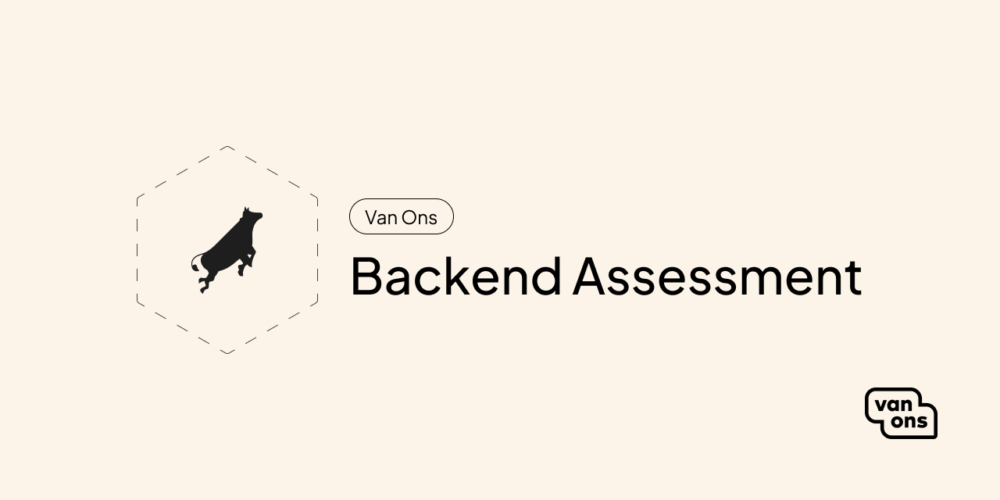

# Backend Assessment

<!-- BADGES -->

De assessment voor backend developers.

## Quick start

Fork deze repository en clone die naar je eigen machine. Open [assessment] en laat ons zien wat je kan! Veel succes!

## Contributing

Please see [contributing] for more information about how you can contribute.

## Credits

We would like to thank the following contributors for their contributions to this project:

* [All Contributors][all-contributors]

## License

The scripts and documentation in this project are released under the [MIT License][license].

---

[assessment]: ASSESSMENT.md
[contributing]: CONTRIBUTING.md
[email]: mailto:opensource@van-ons.nl
[all-contributors]: ../../contributors
[license]: LICENSE.md
